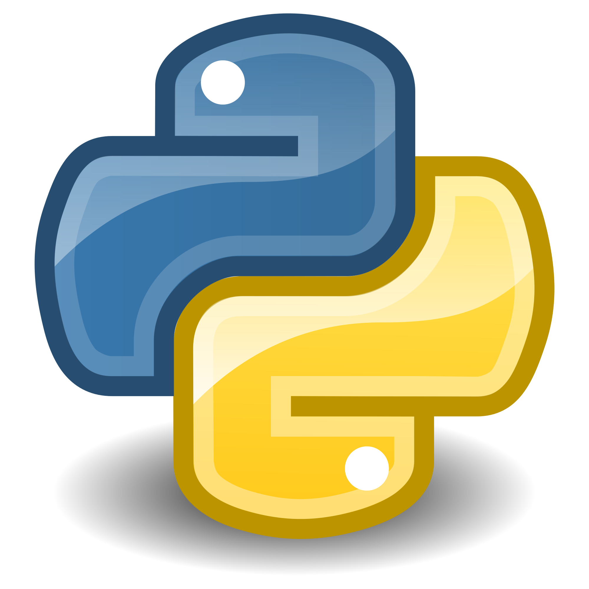

  &nbsp; &nbsp; &nbsp;&nbsp; &nbsp; &nbsp;

---
# Large Language Models for Health and Social Science Research

### Introduction

Welcome to the 'Large Language Models for Health and Social Science Research' class! This GitHub repository contains everything that we'll need for about ~15 hours of lectures. This course begins with a limited knowledge of LLMs and how to use Python to build and use them, and hopefully ends with us being able to conduct useful and applied research. The background of the class will determine how quickly we go. Please star this repository on GitHub if you are taking the class!

This five-day course introduces large language models (LLMs) for researchers in health, social science, and related fields. It combines conceptual foundations, practical experimentation, methodological reflection, and responsible-use considerations. The course treats LLMs not as general-purpose replacements for researchers, but as computational tools that may support classification, summarisation, information extraction, coding, data exploration, and research workflows. A central theme throughout the course is that LLM outputs must be validated, documented, and interpreted carefully, especially when used as evidence in health or social science research. The structure below is intentionally modular. Specific models, tools, datasets, and readings may be updated depending on the audience, institutional constraints, and the state of the field at the time of delivery

### Prearrival

Be sure to consult the [course website](https://lcds-teaching.github.io/llms_062026). An **essential** file for pre-arrival setup can be found at [`./setup.md`](./setup.md) file. A reading list with recommended and essential reading can be found at [`./reading_list.md`](./reading_list.md). You will also need to read through and complete [`./api_setup.md`](./api_setup.md) in advance of the third lab.

If you are new to Python, notebooks, or LLM tooling, start with [`./BEGINNER_GUIDE.md`](./BEGINNER_GUIDE.md) before opening the first lab. The short [`./GLOSSARY.md`](./GLOSSARY.md) defines the main programming, NLP, API, and research-governance terms used across the course.

There are two things in particular which we need:

* **Python**: A powerful, versatile language used for data analysis, visualization, and machine learning, with extensive libraries like pandas, NumPy, and scikit-learn

* **Git**: Git is a distributed version control system that tracks changes in code, enabling collaborative development and efficient project management.

If you are using a Chromebook, you might want to investigate [Google Colab](https://colab.research.google.com).

### Files

The main subdirectories which we will need are:

1. [Lectures](./Lectures), which holds the materials for the lectures which we'll work through together each morning.
2. [Labs](./Labs), which contains information on the labs which we'll do each afternoon.
3. [Solutions](./Solutions), which contains worked versions of the lab notebooks for review after each lab.
4. [Data](./Data), which holds small downloaded or generated datasets used during the course.
5. [Figures](./Figures), which holds figures produced during the course.

### Structure

* **Lecture One**: Foundations: From Text to Language Models (tentatively Day One)
    * What NLP is and why it matters for health and social science
    * Brief history of computational text analysis
    * Tokenisation
    * Word embeddings and distributional semantics
    * Attention and Transformers
* **Lecture Two**: Applications: LLMs in Health and Social Science Research(tentatively Day Two)
    * The emergence of scale
    *  Summarisation
    * Information extraction
    * Evaluation
* **Lecture Three**: Working with Current Models(tentatively Day Three)
    * The current model landscape
    * Choosing a model
    * API use vs locally hosted models
    * Data governance
* **Lecture Four**: Locally Hosted Models (tentatively Day Four)
    * Installing and initialising a local LLM runtime
    * Ollama as the recommended beginner path, with LM Studio as a graphical alternative
    * Choosing small models for modest consumer laptops
    * Pulling model weights, starting a local server, and testing one prompt
    * Localhost, ports, model tags, quantisation, and context limits
    * Troubleshooting installation and initialisation failures
    * Local-model validation and governance for health and social research
* **Lecture Five**: Future Directions and Research Design (tentatively Day Five)
    * Multimodal models
    * LLMs as measurement instruments
    * LLMs and causal inference:
    * Synthetic data and synthetic respondents
    * Agentic systems and tool use
    * Scientific workflows
    * Open questions

### Labs

* **Lab One**: A general introduction to Python
* **Lab Two**: Python for simple NLP and LLM tasks.
* **Lab Three**: Working with remotely hosted models (tentatively Day Three)
* **Lab Four**: Working with locally hosted models (tentatively Day Four)
* **Lab Five**: Advanced topics in LLM implementation (tentatively Day Five)

The lectures should take between two to three hours. The first part of each of the second through fifth days will be a review of the homeworks (~15 minutes). One 'lecture' doesn't necessarily correspond *exactly* to one day: if we finish one lecture earlier on a specific day, we can move on to the next lecture. If we finish all five days of content early, we can spend the remaining time working on and discussing your own specific projects which you want to use LLMs for. At the end of each section of the labs, we will take a ~3-5 minute break from the lecture and you can play around in the notebooks following the set example question (which will then be live coded afterwards when the lectures resume).
